<div align=center>
  <h1>
  <h1>2024 빅콘테스트 데이터 분석 분야
    <h3> 지속가능한 축제 유치를 위한 대중교통 접근성 분석과 탄소발자국 경감 방안 제안
</div>

## 발표 자료
* 발표 자료: [결과보고서]([https://github.com/user-attachments/assets/ffada58c-6f6e-41e7-96de-a8ec7f9e57a7](https://github.com/2024Bigcontest-DA/DA/blob/main/%EB%8D%B0%EC%9D%B4%ED%84%B0%EB%B6%84%EC%84%9D%EB%B6%84%EC%95%BC_%EB%A9%8B%EC%9F%81%EC%9D%B4%ED%86%A0%EB%A7%88%ED%86%A0_%EA%B2%B0%EA%B3%BC%EB%B3%B4%EA%B3%A0%EC%84%9C.pdf))

## 목차
[1. 대회 개요](#1-대회-개요)<br>
[2. 프로젝트 개요](#2-프로젝트-개요)<br>
[3. 데이터 분석](#3-데이터-분석)<br>

---
## 1. 대회 개요
* 대회명: 제 12회 2024 빅콘테스트
* 경진대회 주제: 데이터를 기반으로 디지털 기술 트랜드 및 AI활용 중심의 주제로 범위 확장 등 민간 주도의 선도적 주제 마련

## 2. 프로젝트 개요
### 배경
[1] 코로나19 종식으로 인한 여행 및 관광에 대한 사람들의 관심도 증가<br>
[2] 지역 방문자 수 및 관광지출액의 꾸준한 증가<br>
### 제안
* 대중교통 이용을 통한 탄소발자국 경감
* 지속 가능한 축제 유치<br>

&rarr; <b>"지속가능한 축제 유치를 위한 대중교통 접근성 분석 및 탄소발자국 경감 방안 제시"</b>
### 제공 데이터 
#### OD 데이터
* 데이터 사이즈: 158,838,955 (건)
* 데이터 구성<br>

|컬럼|컬럼명|타입|
|---|---|---|
|origin_hdong_cd|출발지 행정동코드|string|
|dest_hdong_cd|도착지 행정동코드|string|
|date|날짜|string|
|start_time|출발 시각|string|
|end_time|도착 시각|string|
|gender|성별|int|
|age|나이대|int|
|modal|주 이동수단|int|
|origin_purpose|출발지 체류목적|int|
|dest_purpose|도착지 체류목적|int|
|od_dist_avg|평균 이동거리|int|
|od_duration_avg|평균 이동시간|int|
|od_cnts|이동 인원|int|

|주 이동수단 코드|주 이동수단|
|---|---|
|0|차량|
|1|시내버스|
|2|지하철|
|3|도보|
|4|기타|
|5|철도|
|6|시외고속버스|
|7|항공기|

|체류목적코드|체류목적|
|---|---|
|0|귀가|
|1|업무|
|2|학업|
|3|쇼핑여가|
|4|기타|
|5|여행|

#### 체류인구 데이터
* 데이터 사이즈: 169,352,478 (건)
* 데이터 구성

|컬럼|컬럼명|타입|
|---|---|---|
|hdong_cd|체류지 행정동코드|string|
|date|날짜|string|
|time|시간대|string|
|gender|성별|int|
|age|나이대|int|
|purpose|체류 목적|int|
|stay_cnts|체류 인원|int|

|체류목적코드|체류목적|
|---|---|
|0|귀가|
|1|업무|
|2|학업|
|3|쇼핑여가|
|4|기타|
|5|여행|

## 3. 데이터 분석
### 3-1. 데이터 분석 파이프라인
<div align=center>
  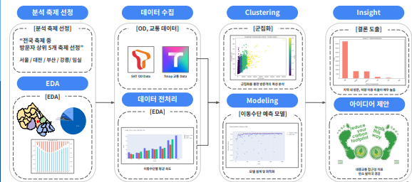
</div>

### 3-2. 분석 축제 선정
[1] OD 데이터가 제공된 기간 내에 진행된 축제인가?<br>
[2] 충분히 많은 수의 참가자가 참가한 축제인가?<br>
[3] 축제 지역이 중복되지 않는가?<br>

&rarr; <b>"9/1 ~ 10/15일 내에 진행된 축제 중 5개 선정"</b>

#### 선정 축제
[1] 서울 세계불꽃축제 (2023.10.07)<br>
[2] 강릉 커피축제 (2023.10.12 ~ 2023.10.15)<br>
[3] 대전 국제와인엑스포(2023.09.03 ~ 2023.09.10)<br>
[4] 부산 국제영화제 (2023.10.04 ~ 2023.10.13)<br>
[5] 임실 치즈축제 (2023.10.06 ~ 2023.10.09)<br>

### 3-3. EDA
* 주요 라이브러리: dask, matplotlib, plotly, ...<br>
제공된 두 데이터는 1억 5천만 건 이상의 데이터로, 일반적인 라이브러리(pandas)를 사용하기에는 데이터가 너무 크다. 따라서, 대용량 데이터를 처리할 수 있는 dask 라이브러리를 사용해 데이터를 로드하고, 사용했다. 
---
#### 지역 내/외 방문 비율, 지역 내 축제 방문객의 이동수단 비율
<div align=center>
  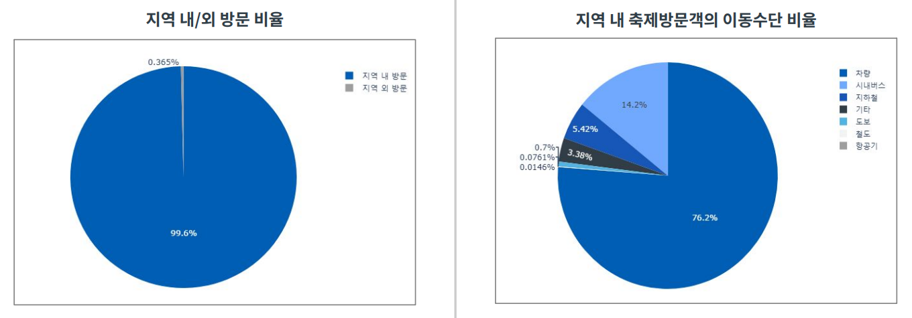
</div>
'지역 내 방문'이 99.6%를 차지 축제 방문객 중 76.2%가 차량을 이용하여 축제에 방문

#### 축제별 마지막 도보시간 분포 
마지막 도보시간이 길수록 방문객의 접근 피로도가 증가할 것이라는 예상
<div align = 'center'>
    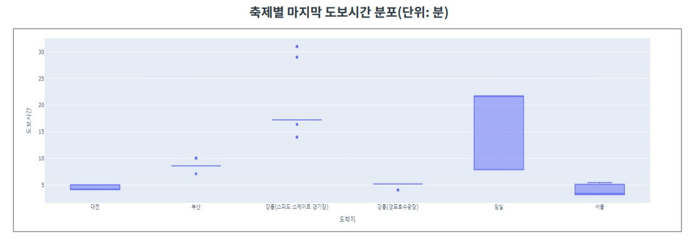
</div>
강릉, 임실의 마지막 도보시간이 상대적으로 높게 나타남 

#### 루트별 평균 환승 횟수
루트별 평균 환승 횟수가 많을수록 방문객의 접근 피로도가 증가할 것이라는 예상
<div align = 'center'>
    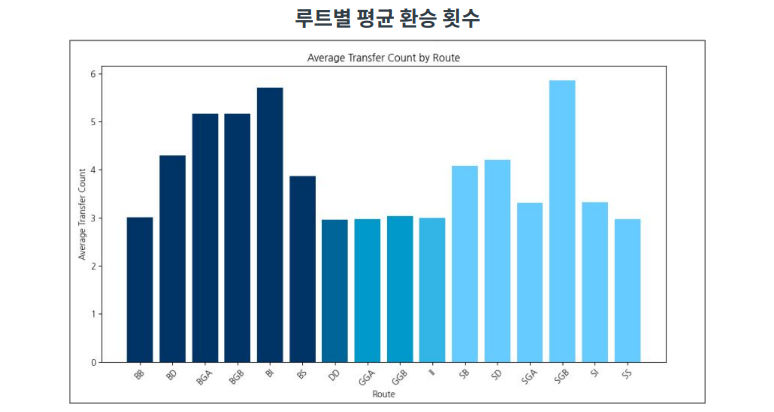
</div>
'부산 -> 임실', '서울 -> 강릉 경포호수광장' 방문객의 루트별 평균 환승 횟수가 높음 

#### 교통수단별 평균 이동속도 (축제기간/전/후 비교)
축제기간과 축제기간 전/후의 이동속도에 차이가 있을 것이라는 예상
<div align = 'center'>
    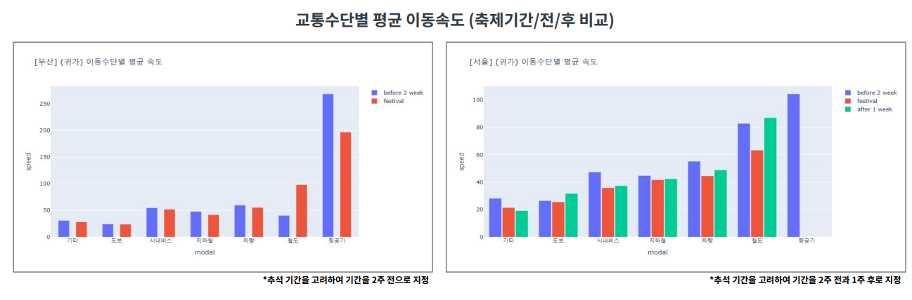
</div>
축제기간 내 이동수단의 평균 속도가 타 기간에 비해 느림, 축제기간 시 축제지역 내 인구 집중 및 교통체증 발생

#### 축제별 방문객 TOP5 지역
<div align = 'center'>
    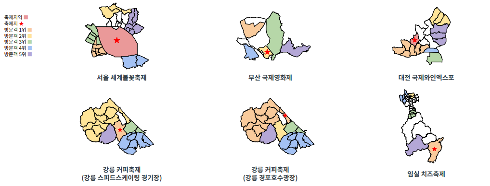
</div>
축제에 방문한 방문객이 출발한 지역은 모두 축제지 근방임을 확인

#### 축제 체류와 귀가 TOP5 체류
방문 데이터, 귀가 데이터, 목적별 시간대별 이동/체류 인구 비교
<div align = 'center'>
    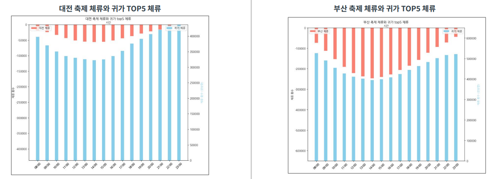
</div>
시간대별 축제 체류 인구와 귀가 체류 인구가 서로 부합 

### 3-4. 데이터 수집
#### 제공 데이터: OD
* 데이터 내용
    * 이동 목적 및 수단 구분
    * 범위: 2023년 9월 1일 ~ 2023년 10월 15일
    * 항목
        * 전국 동 단위 인구 수
        * 전국 동 -> 이동인구 수
    * 행정동 코드: 2023년 7월 기준
* 데이터 수집 및 전처리 과정
    * 방문 데이터: 대중교통을 이용하여 축제에 방문한 방문객 데이터
        * 출발 목적: 모든 목적
        * 도착 목적: 기타/쇼핑여가/여행
        * 기간: 전체 기간
        * 이동수단: 차량을 제외한 모든 이동수단
    * 귀가 데이터: 대중교통을 이용하여 축제에서 귀가한 방문객 데이터
        * 출발 목적: 기타/쇼핑여가/여행
        * 도착 목적: 귀가
        * 기간: 전체 기간
        * 이동수단: 차량을 제외한 모든 이동수단
#### 교통편 데이터 
* 데이터 내용
    * 수집 경로: Tmap 대중교통 길찾기 API
    * 수집 범위: 축제 방문 예상 루트
    * 수집 내용: 예상 루트에 맞는 교통편 및 경로
    * 강릉 커피 축제는 두 장소에서 개최됨, 두 장소 구분<br>
    (A: 스피드 스케이팅 경기장, B: 경포호수광장)
* 데이터 수집 상세
    * 수집 범위
        * 출발지: 임의로 정한 출발지(서울역/부산역), 축제 지역 내 대표역(대전역/강릉역 등)
        * 도착지: 대전, 부산, 강릉, 임실, 서울 축제 장소
        * 수집 경로<br>
        <div align = 'center'>
            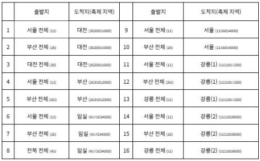
        </div>
* 데이터 상세 설명
    * routeID: 출발지로부터 도착지로 가는 루트 코드
    * (형식): '출발지 코드 + 도착지 코드 + 루트 번호'
    * 다중 경로의 경우, 각각 하나의 경로로 카운트
    * 소요 시간(time)은 초(s) 단위
    * 루트 간 비교를 위한 상세정보 추가: totalDistance, totalTime, totalWalkDistance

* 지역별 코드 구분<br>

|지역|코드|
|---|---|
|대전|D|
|부산|B|
|강릉(스피드스케이팅 경기장)|GA|
|강릉(경포호수광장)|GB|
|임실|I|
|서울|S|

### 3-5. 데이터 전처리
* 파생변수 추가
    * 이동속도(speed)<br>
    $speed = \frac{distance * 60}{duration * 1000}$
    * 주말 여부(isWeekend): False(평일), True(주말)
    * 축제기간 포함 여부(isFestival): False(축제기간 X), True(축제기간 O)
* 결측치 처리
    * dest(도착지): 교통편 데이터와 매핑되지 않는 데이터(결측치) 제거
    * origin_purpose: 대체 불가, 제거
* 지역 코드 처리
    * 출발지: S(서울), B(부산), D(대전), I(임실), G(강릉)
    * 도착지: D(대전), B(부산), I(임실), S(서울), GA(강릉 스피드 스케이팅 경기장), GB(강릉 경포호수광장)

### 3-6. 방문객 클러스터링
* 사용 모델: K-means 
* 기준: 평균 이동거리, 평균 이동시간 
---
#### 군집 수 결정
<div align = 'center'>
    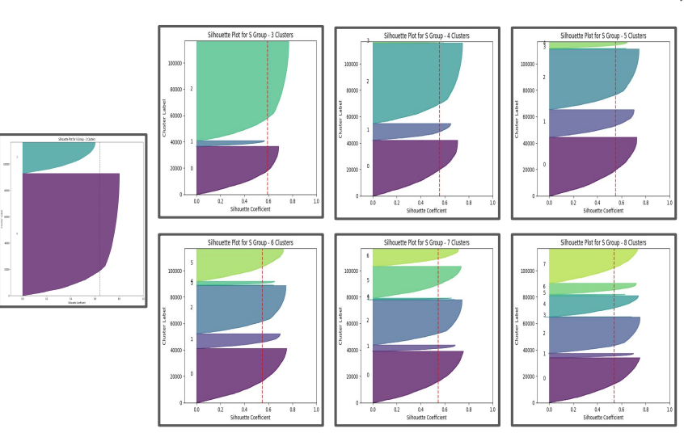
</div>
군집 수가 2일 때, 실루엣 점수가 가장 높지만, 데이터 특성 및 분포를 감안하여 군집 수를 4로 결정

#### 1. 서울 세계 불꽃 축제
<div align = 'center'>
    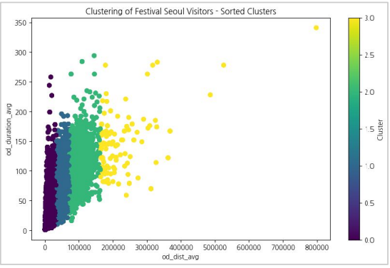
</div>

* 축제 특성
    ```
    1. 부산/임실/강릉에 비해 방문객들의 평균 이동거리 및 시간이 줄어듦
    2. 타 지역 축제에 비해 지하철의 이용 비율이 높게 나타남
    3. 9세 이하 - 30대, 10대 - 40대의 비율이 높은 것으로 보아, 가족 단위 방문 예상
    ```
* 군집 특성
    ```
    1. 지하철/시내버스를 이용하여 축제를 방문하는 방문객이 높음 (Cluster 1)
    2. 거리가 멀수록 출발시간이 앞당겨짐 (Cluster 0~3)
    3. 평균 이동거리가 가까워도 소요시간이 200분 이상이 존재, 교통체증이 극심했음을 추측할 수 있음 (Cluster 0)
    ```

#### 2. 부산 국제 영화제
<div align = 'center'>
    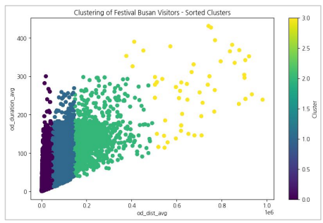
</div>

* 축제 특성
    ```
    1. 서울/대전에 비해 사람들의 평균 이동거림 치 시간이 늘어남
    2. 타 지역 축제에 비해 시내버스의 이용 비율이 높게 나타남
    3. 메인 컨텐츠인 '아시아콘텐츠어워즈'가 진행된 일요일이 가장 많은 방문객을 보임
    ```
* 군집 특성
    ```
    1. 주 방문 연령대는 20~30대 (Cluster 0~3)
    2. 이동거리가 멀어질수록 남성 방문객의 비율이 증가 (Cluster 2~3)
    3. 이동거리가 가까움에도 불구하고 소요시간이 200~300분인 데이터를 확인, 교통체증이 있었을 것으로 예상 (CLuster 0)
    ```

#### 3. 대전 국제 와인 EXPO
<div align = 'center'>
    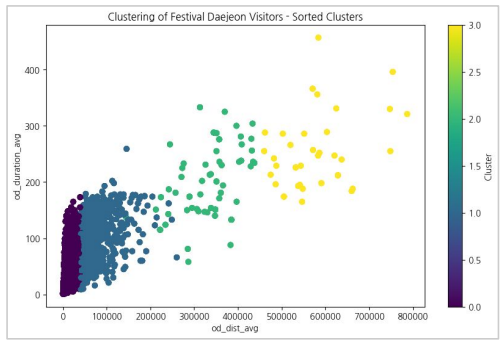
</div>

* 축제 특성
    ```
    1. 타 지역 축제에 비해 교통체즈잉 덜 나타남
    2. 근처에 공원이 있어 9세 이하와 30대 방문객의 비율이 높은 것으로 예상됨
    3. 축제가 마무리되는 시간대인 17시부터 방문객들의 귀가 비율이 높아짐
    4. 이용한 교통수단 중 차량의 비율이 타 지역 축제에 비해 월등히 높음 (택시 예상)
    ```
* 군집 특성
    ```
    1. 대중교통을 이용해 축제를 방문하는 방문객이 거리가 멀수록 감소 (Cluster 0~3)
    2. 축제 방문이 목적인 방문객의 출발시간과 도착시간이 앞당겨짐 (Cluster 0~3)
    3. 시간과 거리에 상관없이 방문객 9세 이하의 비율이 높음 (Cluster 0~3)
    ```

#### 4. 강릉 커피 축제 (강릉 스피드 스케이팅 경기장)
<div align = 'center'>
    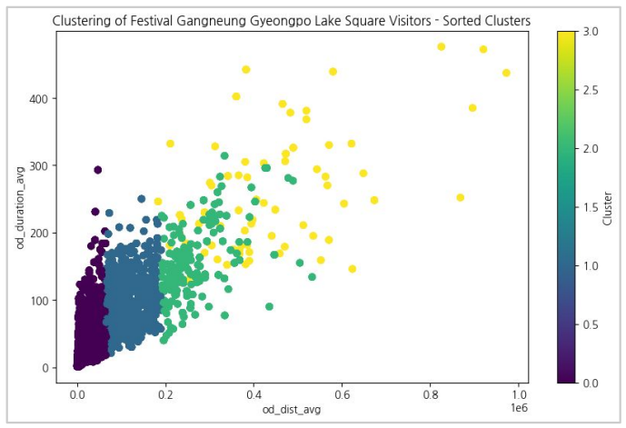
</div>

* 축제 특성
    ```
    1. 타 지역에 비해 도착 목적의 '기타', '여행'의 비율이 높음
    2. 9세 이하, 30대, 40대의 비율이 높은 것으로 보아, 가족 단위 방문으로 예상됨
    3. 모든 군집에서 여성의 비율이 남성보다 높음
    ```
* 군집 특성
    ```
    1. 거리가 가장 먼 군집에서 '철도'를 이용한 방문객의 비율이 높음 (Cluster 1)
    2. 여성 방문객의 비율(77.4%)이 높음 (Cluster 2)
    3. 이동거리가 가장 먼 군집에서 9시에 가장 많이 출발함 (Cluster 3)
    ```

#### 5. 강릉 커피 축제 (강릉 경포호수광장)
<div align = 'center'>
    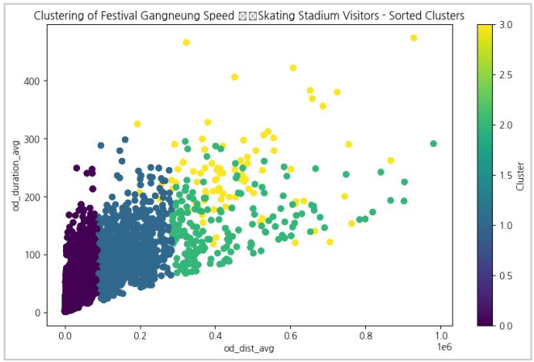
</div>

* 축제 특성
    ```
    1. 타 지역 축제에 비해 여행을 목적으로 방문한 방문객의 비율이 높음
    2. 경포호가 있어 20대 방문객의 비율이 높음
    3. 방문객 성별 비율의 차이가 근소한 것으로 보아 연인 단위로 방문한 것으로 추측됨
    ```
* 군집 특성
    ```
    1. 중간거리에서 일정하지 않은 소요시간을 나타내는 것으로 보아 교통체증의 영향을 크게 받는 것으로 추측됨 (Cluster 1)
    2. 거리가 멀수록 철도 이용 방문객 비율이 높아짐 (Cluster 3)
    3. 도착시간 13~14시에 방문객 비율이 높음 (Cluster 0~3)
    ```
#### 6. 임실 N 치즈 축제
<div align = 'center'>
    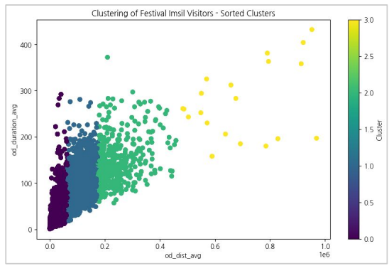
</div>

* 축제 특성
    ```
    1. 철도를 이용한 방문객이 거의 없는 것으로 나타남
    2. 30~50대 방문객의 비율이 높음
    3. 9세 이하 방문객의 비율이 높은 것으로 보아 가족 단위로 참가하는 방문개깅 많다고 추측할 수 있음
    ```
* 군집 특성
    ```
    1. 여성에 비해 방문하는 남성의 비율이 매우 높음 (Cluster 1~3)
    2. 대부분의 방문객은 지역 내 방문 또는 인근 지역에서 방문
    3. 짧은 거리에서도 소요시간이 300분 가까이 걸리는 것으로 보아 교통체증이 심하고 축제장 입구에서의 혼잡이 예상됨 (Cluster 0)
    ```

### 3-7. 이동수단 예측 분류 모델
#### 데이터 전처리
* Data Scaling
    * 결측치 제거
    * standard scaling
* Data Encoding
    * Label Encoding
* Data Split
    * train:test = 0.7:0.3
    * folds = 10
* class weight
    * sklearn.utils.class_weight.compute_class_weight
    * class_weight = 'balanced'
* 시간 컬럼의 순환적/연속적 특성 반영: start_time, end_time<br>
    [참고 링크](https://www.kaggle.com/code/avanwyk/encoding-cyclical-features-for-deep-learning)
    ```
    data['start_sin'] = np.sin(2 * np.pi * data['start_time']/24.0)
    data['start_cos'] = np.cos(2 * np.pi * data['start_time']/24.0)

    data['end_sin'] = np.sin(2 * np.pi * data['end_time']/24.0)
    data['end_cos'] = np.cos(2 * np.pi * data['end_time']/24.0)
    ```
    <div align = 'center'>
        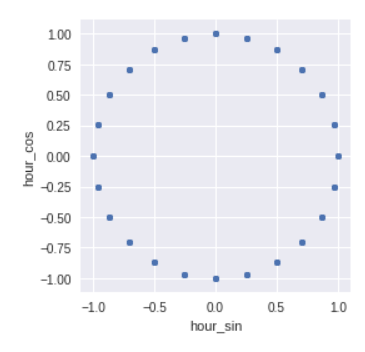
    </div>
#### 모델링
* Model Selection
    * Pycaret
    * 불균형 데이터이므로, f1-score를 성능 지표로 선택
* Selected Model
    * Random Forest

#### 변수 선택
* feature importances 
* VIF

#### 하이퍼 파라미터 튜닝
* optuna 
* 최적의 하이퍼 파라미터
    * n_estimators = 204
    * max_depth = 10
    * min_samples_split = 14
    * min_samples_leaf = 2
    * max_features = 'sqrt'

#### 최종 모델
<div align = 'center'>
    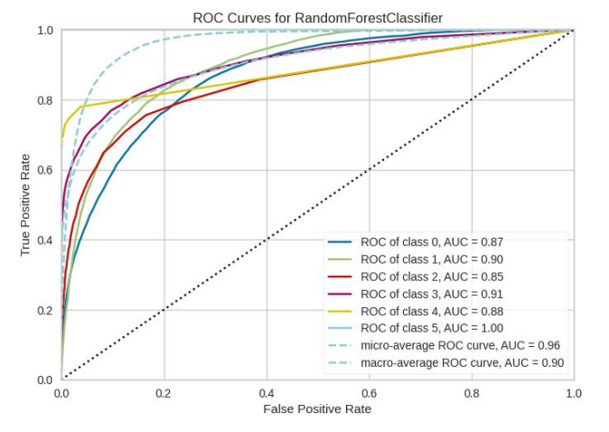
</div>

* accuracy: 0.7853
* AUC: 0.9248
* F1-score: 0.7853

#### 부분 의존도(PDP)를 통한 모델 해석
부분 의존도 그래프(PDP, Partial Dependence Plot)를 통해 개별 변수가 예측에 미치는 영향 해석
<div align = 'center'>
    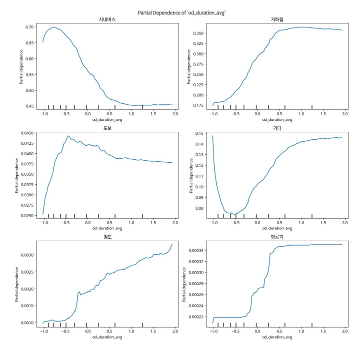
</div>

* 평균 이동거리: 평균 이동거리가 길수록 시내버스의 확률 감소, 지하철/철도/항공기의 확률 증가
* 평균 이동시간
    * 평균 이동시간이 25분 이내인 경우, 시내버스/도보의 확률 증가 
    * 평균 이동시간이 25분 이상 ~ 63분 이내인 경우, 지하철/기타의 확률 증가
    * 평균 이동시간이 63분 이상인 경우, 철도/항공기의 확률 증가
* 목적지
    * 강릉 커피축제: 시내버스
    * 서울세계불꽃축제: 지하철
    * 대전 와인 엑스포: 도보
    * 임실 치즈 축제: 철도
    * 부산 국제 영화제: 항공기
